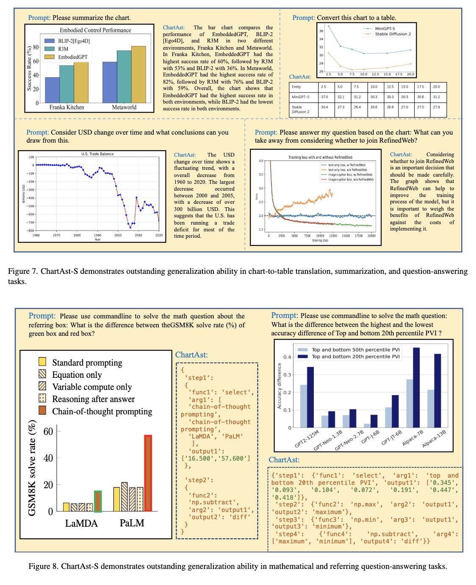

# ChartAssisstant: A Universal Chart Multimodal Language Model via Chart-to-Table Pre-training and Multitask Instruction Tuning


We have developed ChartAssistant, which uses large-scale chart data to align and instruction tuning. The model possesses powerful mathematical computation capabilities and achieves state-of-the-art performance on multiple datasets without the need for downstream dataset finetuning.

**This repo is built upon [LLaMA2-Accessory](https://github.com/Alpha-VLLM/LLaMA2-Accessory/tree/main)**

## Note

- We release an online demo: http://106.14.127.192:7861/ 


## ChartAssisstant

Charts play a vital role in data visualization, understanding data patterns, and informed decision-making. However, their unique combination of graphical elements (e.g., bars, lines) and textual components (e.g., labels, legends) poses challenges for general-purpose multimodal models. While vision-language models trained on chart data excel in comprehension, they struggle with generalization. To address these challenges, we propose ChartAssistant, a chart-based vision-language model for universal chart comprehension and reasoning. ChartAssistant leverages ChartSFT, a comprehensive dataset covering diverse chart-related tasks with basic (e.g. bars and pies) and specialized (e.g. radars, and bubbles) chart types. It undergoes a two-stage training process, starting with pre-training on chart-to-table parsing to align chart and text, followed by multitask instruction-following fine-tuning. This approach enables ChartAssistant to achieve competitive performance across various chart tasks. **Experimental results demonstrate significant performance gains over the state-of-the-art UniChart and Chartllama method, especially outperforming them on real-world chart data with zero-shot setting.** 




## Environment
It is same as [LLaMA2-Accessory](https://github.com/Alpha-VLLM/LLaMA2-Accessory/tree/main)

## Inference

replace pretrained_path as the pretrained model path
```
sh accessory/exps/finetune/mm/test.sh
# run accessory/single_turn_eval.py
```

## Training
```
sh accessory/exps/finetune/mm/chart.sh
# run accessory/main_finetune.py
```
## Gradio demo
```
sh accessory/demo/start.sh
```


  

